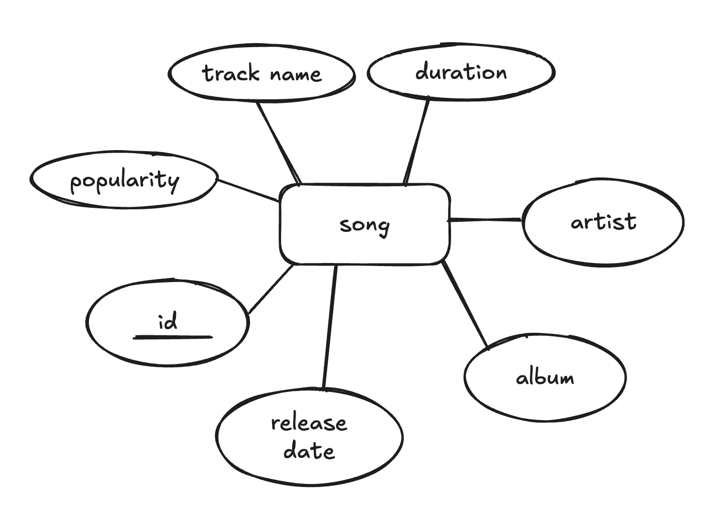

# DIS-projekt

## ER

## Regex
`[a-zA-Z0-9\s]+` is used to find songs/albums/artists that have the given input in them. 
We then show only matches.

## preparation
- Install python3 and psycopg2 (with pip)
- Download the .csv file and change line 36 in `main.py` to the path to the download
- create a database with PostGres, named `spotify_db`

## how to run
- run `python3 main.py` in the root directory
- open http://127.0.0.1:5001 as shown in the terminal
- interact with the database (handled with SQL) using the search bar (searches among songs, albums and artists)